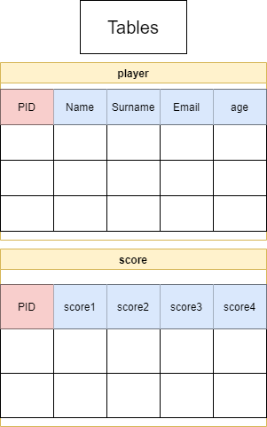

# QA--Project1-- MTG tournament page

## Index
1. 1-Intro
2. 2-Overview
3. 3-Objectives
4. 4-Design notes
5. 5-Player flow
6. 6-How it all works
7. 7-Potential extras.

## 1-Intro
This project is designed to assist tournement organisers in creating and running tournaments for Magic the Gathering. By providing a central location for player information and scores to be recorded. It will also give you the winners after all scores are entered. Allowing the tournament organisers more time to run the event.

## 2-Overview
This solution will be able to:
-Manage Player details such as add/edit (id, name, surname, age, email, cellphone,)
-Manage tourament scores add/edit (id, score 1, score 2, score 3, score 4)
-Have a high score table showing the top players and their scores

The tournament can be run with any number of players past 8. Each player will need to play 4 games. The scores for the games will be as follows:
1- Loss
2- Draw
3- Win

After 4 games the max score possible will be 12. 

## 3-Objectives
1. Have a simple web based app
2. Create tables for Players and scores.
3. Create easy to use player info sections
4. Create easy to use score updates
5. Create a table with total scores and names
6. Expanded - create an easy way to clear scores table for new tournament

## 4-Design notes
1. The final product will be a flask web app running python3 and mysql.

2. Modules that will be used are:
    1. flask
    2. pymysql
    3. wtforms
    4. something

3. Entity Relationship

Above we can see the different components making up this app. 
Webpages are highlighted with green
Database tables are highlighted with orange.

Below please see the database structure.

## 5-User Flow
The product is intended to be run in the following manner:

1. The admin will begin th tournament by gathering all players info. this will be fed into the new player section and added to the player table. Each player gets a unique id.

2. The players will then begin the tournament. After each of the 4 games they will report with results to the admin. These results will be entered into the scores table associated with the player ID.

3. During and after the tournament the total scores will be added up and displayed on a table, from highest score to lowest. The scores will have a total and a name.

4. Extended- After all is done the admin should be able to create a new tournament. This will delete all the data on scores table and allow it to start again.

## 6-Security and safety

Although this project will not contain vital information security must always be considered.

1. SQL or VM go down
in the event that either the vm or SQl are down the service will stop functioning. GCP mitigates alot of this risk however will need to look at redundent vm. SQL should suffice for now.

2. Exposed SQL details
The sql details are no longer in the source code, instead they are stored as enviroment variables.

3. SQL injection
although we have no security against sql injections, i have set the SQL server to only accept requests from the VM IP address which is reserved. This should eliminate most of the risk of SQL inhection.

4. Lack of tests
there have been no succesful tests of the app. Thus we cannot know it is deployed correctly each time. This will need to be fixed.

## 7-Potential extras
Next will be to create a full tests.py and deploy.sh. This will allow for easy deployment of new VM's with the only configuration required being to add the IP address of the VM to the sql allowed connection.

After that we will look to save past tournameent ttables instead of cleariing the data from them. This will allow us to build up better records from past tournaments.

Use of venv with the python app will allow better deployment.
